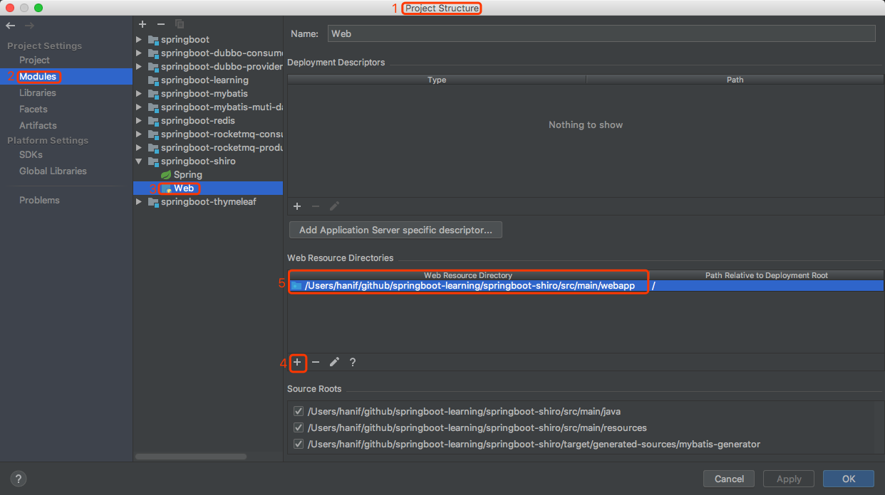

# springboot-learning

 * Springboot framework learning, and integration of mybatis, dubbo and other frameworks

## -- contents --

#### Recommended order：

### springboot module
 * Build a springboot framework
 
### springboot-mybatis module
 * Springboot integrates mybatis.Then we can visit database simply.  
 * The springboot configuration file has three forms: application.properties, application.yml and xml files. 
 Choose one of them when you use it. When springboot integrates mybatis, you can use the mybatis-generator plugin 
 to automatically generate the dao layer entity class, mapper file and xml file.  
 * This module uses the third form, but contains the configuration files needed for the three forms.
 
### springboot-redis module
 * Springboot integrates redis  
 * Redis is a key-value storage system. Similar to Memcached, it supports storing more value types, 
 including string, list, set, zset (sorted set), and hash (hash typeName). These data types support push/pop, add/remove, 
 and intersection set and difference sets and richer operations, and these operations are atomic.
 
### springboot-rocketmq-producer module  
### springboot-rocketmq-consumer module
 * Springboot integrates RocketMQ
 * Apache RocketMQ™ is an open source distributed messaging and streaming data platform.
 See http://rocketmq.apache.org
  
### springboot-dubbo-provider module
### springboot-dubbo-consumer module
 * Springboot integrates dubbo
 * Apache Dubbo™ (incubating) is a high-performance, java based open source RPC framework.
 * The dubbo contains four main components:    
   * Provider: The Provider exposes the service party as a "service provider."   
   * Consumer: The Consumer calls the remote service party to call it "service consumer."   
   * Registry: The Central Directory Service for Registry Service Registration and Discovery is called the 
   Service Registry.   
   * Monitor: The log service of the number of calls and the time of calling the Monitor Statistics Service is called 
   the Service Monitoring Center. 
 * Since the dubbo provider and the consumer profile are in the same project, the provider and the consumer cannot start 
 at the same time.   
 When the provider is started separately, the service is registered to the service center;   
 when the consumer is started separately, the service is registered to the service center.   
 Since the consumer imports the provider module dependency, the consumer can use the corresponding service of the 
 service center.
  
### springboot-mybatis-muti-datasource
 *  Use of master-slave database
  
### springboot-thymeleaf module
 * Springboot integrates thymeleaf
 * slf4j jquery echarts
 
### springboot-shiro module
 * Springboot integrates Shiro
 * Shiro is an open source project under Apache, which we call Apache Shiro. It's a very easy-to-use security framework 
 for Java projects that provides authentication, authorization, encryption, session management, and a security framework 
 that works like Spring Security, but compared to Spring Security, Shiro uses a comparison. Easy to understand and 
 easy to use authorization method. Shiro is a lightweight framework that is much simpler than security and less 
 complex than security.  
 * The basic function points are as shown below:  
   
   * Authentication: Authentication/login to verify that the user has the appropriate identity;
   * Authorization: Authorization, that is, permission verification, to verify whether an authenticated user has a 
   certain authority; that is, to determine whether the user can do things, such as: verify whether a user has a role. 
   Or fine-grained to verify whether a user has a certain authority on a resource;
   * Session Manager: Session management, that is, a user is logged in as a session. Before it quits, all its 
   information is in the session; the session can be either a normal JavaSE environment or a Web environment;
   * Cryptography: Encryption, protecting the security of data, such as password encryption stored in the database, 
   rather than plaintext storage;
   * Web Support: Web support, which can be easily integrated into the web environment;
   * Caching: Caching, for example, after a user logs in, their user information and roles/permissions do not have to be 
   checked every time, which can improve efficiency;
   * Concurrency: shiro supports concurrent verification of multi-threaded applications, that is, if another thread is 
   opened in one thread, the permission can be automatically propagated;
   * Testing: Provide test support;
   * Run As: Allows one user to pretend to be accessed as another user (if they allow);
   * Remember Me: Remember me, this is a very common feature, that is, once you log in, you will not be logged in the 
   next time you come back.
 * Note: 
   * Shiro does not maintain users and maintain permissions; these require us to design/provide; then inject it into 
   Shiro through the appropriate interface.  
   * How to start:  
     * $ cd {your_project_folder_path}  
     * $ ls //Check if you are in the same place with the pom.xml  
     and then type  
     * $ mvn spring-boot:run
   * springboot project how to identify webapp folder:  
   
 
 
 
 
 
 
 
 
 
 
 
 
 
 
 
 
 
 
 
 
 
 
 
 
 
 
 
 
 
 
 
 
 
 
 
  
  